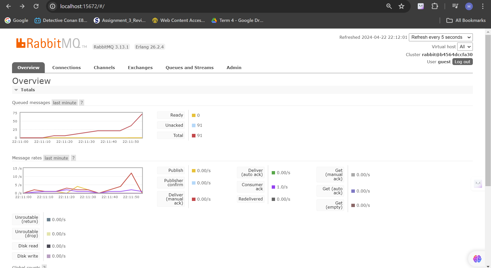
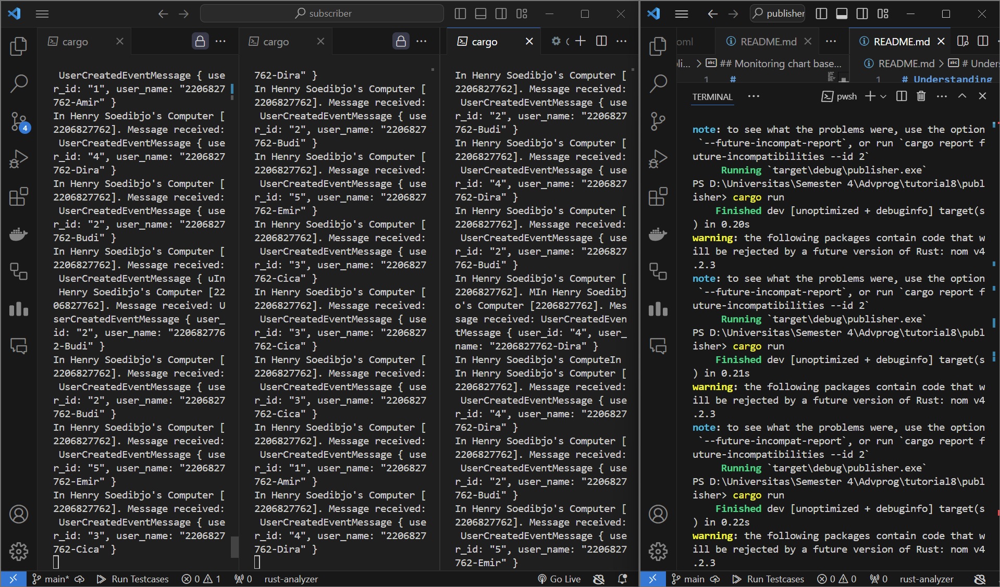
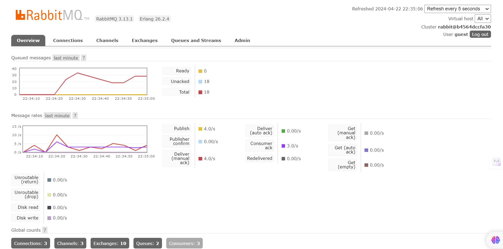

# Understanding subscriber and message broker

1. What is amqp?

AMQP (Advanced Message Queuing Protocol) adalah sebuah protokol jaringan yang memungkinkan pertukaran data antara sistem yang terpisah. Protokol ini mengatur aturan untuk format, pengiriman, penerimaan, dan interpretasi data. Penggunaan AQMP pada RUST memungkinkan implementasi sistem antar layanan yang efisien, memfasilitasi pengiriman pesan seperti event, request, atau command tanpa keharusan penerima untuk tersedia secara langsung atau terhubung secara langsung dengan pengirim. Hal ini memungkinkan program di platform yang berbeda untuk berkomunikasi dan bertukar data secara efektif.

2. What it means? `guest:guest@localhost:5672` , what is the first guest, and what is the second guest, and what is localhost:5672 is for?

Guest pertama pada `guest:guest@localhost:5672` adalah *username* yang digunakan untuk autentikasi ke server AMQP. Biasanya 'guest' ini merupakan *username default* yang sering digunakan saat menginstal RabbitMQ secara lokal.  Guest kedua pada `guest:guest@localhost:5672`adalah kata sandi yang sesuai dengan username'guest' untuk autentikasi. Sedangkan 'localhost:5672' menunjukkan bahwa server AMQP berjalan di mesin lokal, dan portnya adalah 5672. Dengan demikian, secara keseluruhan, guest:guest@localhost:5672 menginstruksikan aplikasi untuk terhubung ke server AMQP menggunakan nama pengguna 'guest', kata sandi 'guest', melalui port 5672 di mesin lokal.

## Lampiran Simulation slow subscriber

Grafik diatas menunjukan bahwa pada suatu waktu terdapat 91 pesan yang *queued messages*. Hal ini terjadi karena ada penundaan dalam proses penerimaan pesan oleh *subscriber*, yang menyebabkan akumulasi pesan karena *subscriber* tidak dapat memproses pesan secepat yang dikirimkan oleh *publisher*. Fenomena ini diperparah oleh pengulangan *cargo run* pada *publisher*, yang menghasilkan pengambilan pesan (*prefetch count*) yang terlalu tinggi oleh *subscriber*, sehingga menyebabkan *subscriber* terlalu banyak pesan untuk diproses secara bersamaan. Oleh karena itu, ketidakseimbangan antara laju pengiriman pesan oleh *publisher* dan pemrosesan pesan oleh *subscriber* dapat menghasilkan antrian pesan.

## Reflection and Running at least three subscribers

Grafik diatas menunjukan bahwa peningkatan jumlah subscriber memiliki dampak positif terhadap pengurangan jumlah pesan yang tertunda dalam antrian. Ini menandakan bahwa dengan adanya beberapa subscriber, pesan dapat diproses secara simultan. Dengan kata lain, beberapa subscriber dapat bekerja bersama-sama untuk memproses pesan yang masuk. Hal ini memungkinan distribusi beban kerja yang lebih merata dan mempercepat waktu respon keseluruhan sistem terhadap pesan yang masuk. Oleh karena itu, peningkatan jumlah subscriber akan membantu menjaga keseimbangan antara laju pengiriman pesan oleh publisher dan laju pemrosesan pesan oleh subscriber, yang berdampak positif terhadap penurunan antrian dalam message queue.